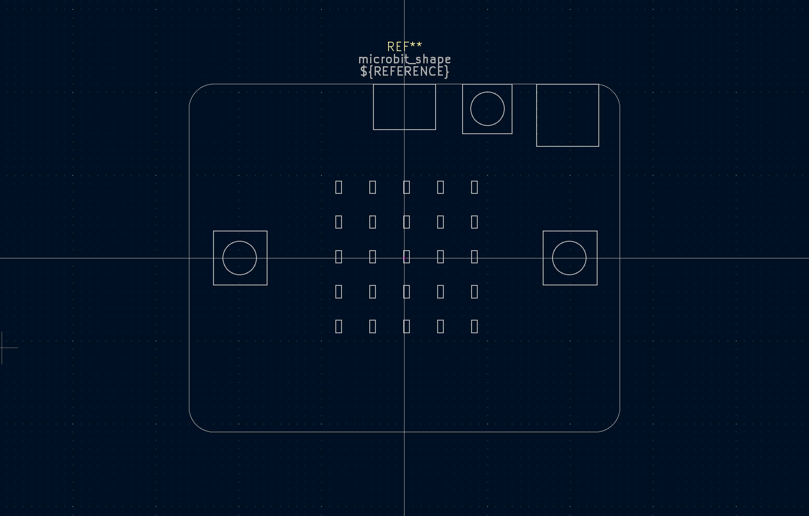
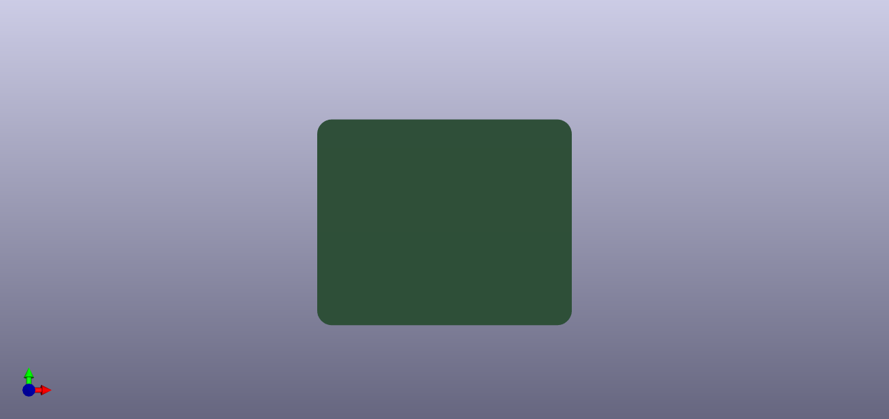
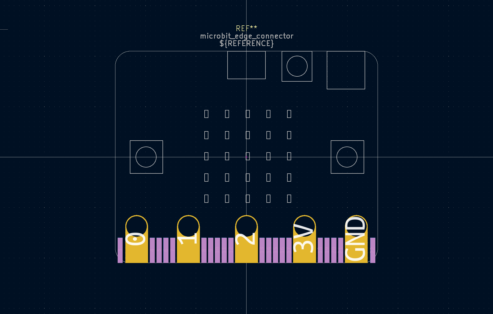
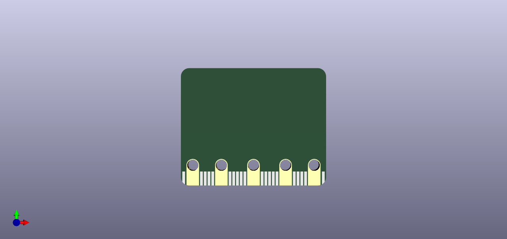
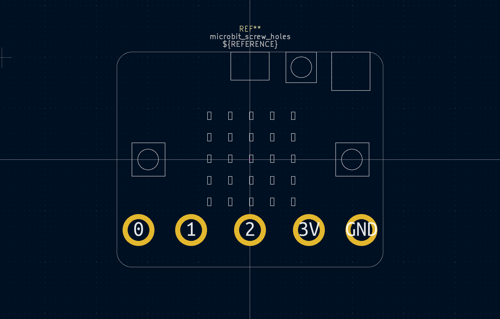
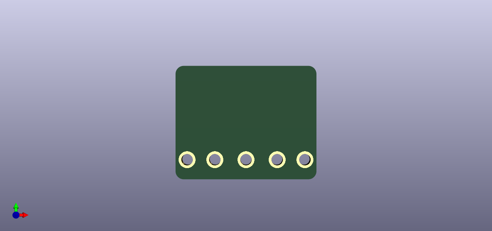

# microbit-form-factor
Footprints with layout and shape of Microbit board usefull for custom Microbit "Backpack" extensions or custom boards in  it's form factor.

## Shape
Microbit shape with front interface layout.
|Footprint   |Render|   
|------------|------------|
| |  |

## Edge connector
PCB ready for classic microbit [connector](https://tech.microbit.org/hardware/edgeconnector/). Great footprint for its counter part could be found [here](https://github.com/anthonykirby/kicad_microbit_connector). 
|Footprint   |Render      |   
|------------|------------|
| |  |

## Solderable standoffs
Cheap and dirty solution if you are okay with the use of big pads only. In combination of 3mm screws and standoffs it is the fastes solution.

Standoff sources:
- [Adafruit](https://www.adafruit.com/product/4206)
- [LCSC](https://www.lcsc.com/product-detail/Other-span-style-background-color-ff0-nuts-span_YIYUAN-SMTSOM320BTR_C5301780.html)

|Footprint   |Render      |   
|------------|------------|
| |  |

>Measurements are based on [great Kitronik resources](https://kitronik.co.uk/blogs/resources/bbc-microbit-cad-resources) and measurements of my bits ;)
